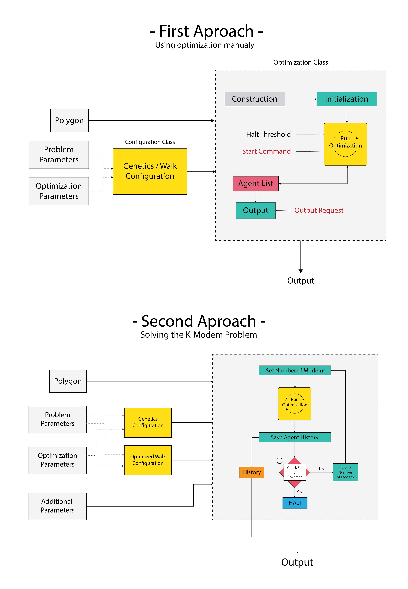

# Code Documentation

In this document, you can find detailed explaination on the code itself.  

There are a total of eight classes in _ku.cs.model.sa_ package (except main) which are the main logic of the program and three classes in _ku.cs.model.sa.graphics_ which provide some basic graphic for the logic (_note that this part is still in development phase_).  
  
__Logic:__  

- Modem
- Polygon
- VPCalculator
- GA_Config
- OW_Config
- GeneticsAlgorithm
- OptimizedWalk
- Util  

__Graphic:__

- PlotFrame
- PlotPanel
- Plotter
  
We go through each class one by one, explaining it's functionality and providing information on importatnt attributes and methods of each class.

## Logic Workflow

The logic of the program can be takean apart into three different sections.

1. The __Data Structure__ section which basically provide the classes needed to create suitable input/output objects for the algorithms. These classes are *Modem* , *Polygon* , *GA_Config* and *OW_Config*.  
2. The __Algorithm and Optimization__ which carry the main functionality of the program and consist of classes *VPCalculator* , *GeneticsAlgorithm* and *OptimizedWalk*.
3. The **Util** class in which you can find static methods for different uses such as *Benchmarkingthe algorithms* and *Solving K-Modem Probelm*.
  
There are two ways in which the program can be used.

- The first way, is to find optimal positions of k-modems for given number of _k-modems_ and peneteration rate _k_ in a polygon _p_.  
- The second way is to use the static methods provided in _Util_ class to either verify the concluded results in the article or to solve the K-Modem problem for a given polygon.  
_
The workflow for both aproaches are shown in the diagram bellow.

### First Aproach, Manual Optimization

For manulay using the optimization algorithms, the user is asked to provide a configuration file based on the algorithm and an input polygon to perform optimization on.  
The user can use the `polygon` class directly to import the polygon into the program. Currently there is no way to create the polygon on sight. Supported file formats for the polygon calss are __wkt__ and JTS __XML__ polygon file which can be used to import simple or complex polygons.  
The configuration onject has to be created based on the optimization algorithm. In this configuration object, the parameters required for runnig the optimization are saved. These parameters can be divided into tow category. __Problem parameters__ provide constraints of the problem which are _number of modems_ , _peneteration rate_ and _number of allowed collision_. __Optimization Parameters__ are used to provide constratints for the algorithms them self. These parameters are explained thorughly for each algorithm later on in the docs.  
After running the optimization, the user can use the provided methods in each optimization class to retrive the result of the run.

### Second Aproach, Benchmarks and K-Modem Solver

Each benchmarking mehtod is explained throughly in it's own section later on.  
The K-Modem solver requires a polygon, a genetic optimization config, a optimized walk optimization config some and additional parameters which is explained later on.  
The method then uses these parameters to loop through optimizing the polygon for different number of modems. For `numberOfModems = 1` the Optimized Walk is used as it is suited to optimize the position of one modem. For `numberOfModems > 1` genetics optimization is used instead.  
After reaching 100% coverage (or the threshold provided by user) the algorithm is halted and an ArrayList of agents (genes) is returend for each number of input modems. The user can later use this ArrayList to retrive the modem's positions.

## Logic Classes

- [__Modem__](#Modem)
- [__Polygon__](#Polygon)
- [__VPCalculator__](#VPCalculator)
- [__GA_Config__](#GA_Config)
- [__OW_config__](#OW_Config)
- [__Genetics Algorithm__](#GeneticsAlgorithm)
- [__OptimizedWalk__](#OptimizedWalk)
- [__Util__](#Util)

### Modem

### Polygon

### VPCalculator  

### GA_Config  

### OW_Config  

### GeneticsAlgorithm  

### OptimizedWalk  

### Util  

## Graphics  

### PlotFrame

### PlotPanel

### Plotter
